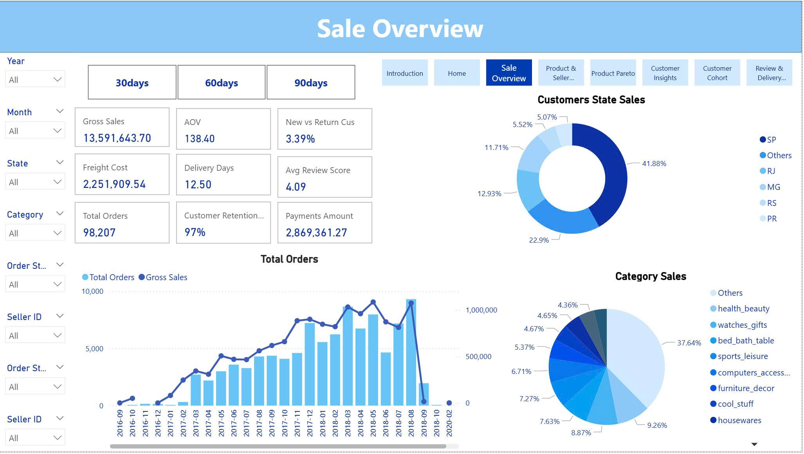
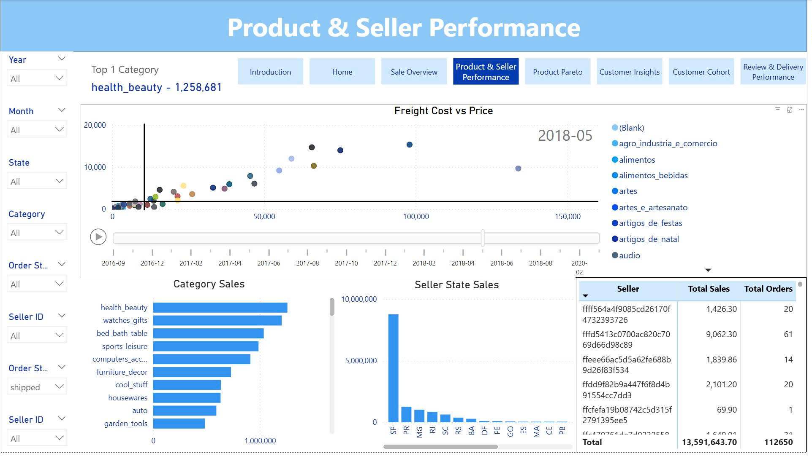
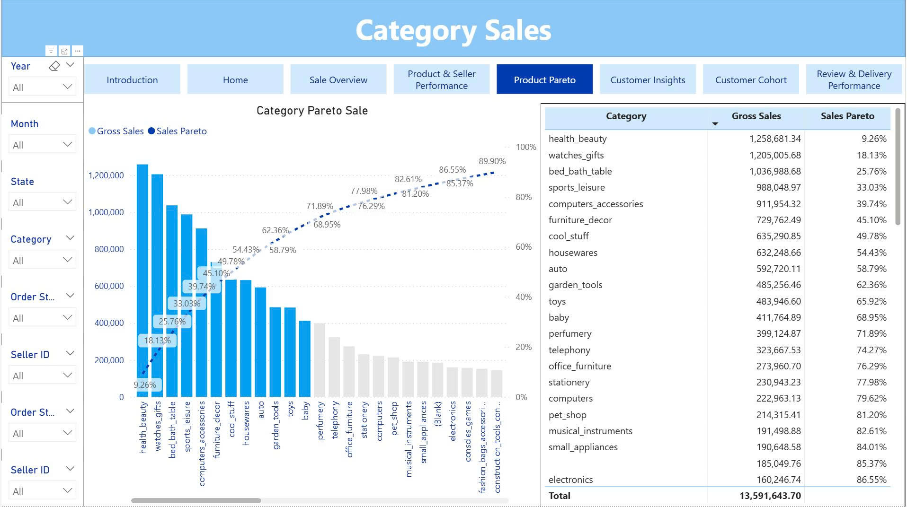
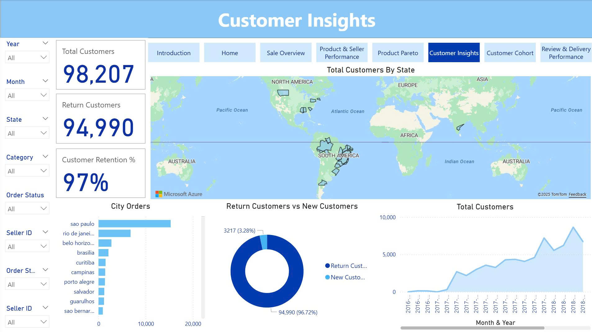
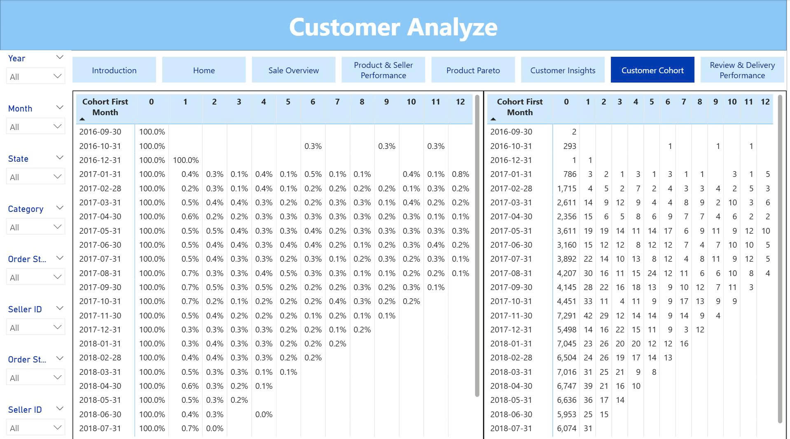
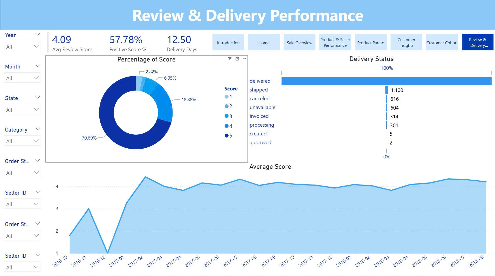

# Power BI — Sales & Operations Storytelling Dashboard

A production-style Power BI report that gives leadership a **30-second narrative** across **Sales · Customer Insight · Review Score & Delivery**.  
Architecture follows a **Star Schema** and UX is designed around **Cards → Trends → Drill-through**.

> **PBIX:** `release/BI.pbix`  
> **Data:** Brazilian_E-Commerce_Public_Dataset_by_Olist (Kaggle)

---

## Highlights / Results
- Standardized KPIs: **Gross Sales, Freight Cost, Total Orders, Total Customers, Avg Review Score, New vs. Return Customers**.
- **Role-based navigation** with drill-through from summary → product/customer → review & delivery deep dives.
- **Performance:** Page load time < 3 seconds (Import mode, ~1.2 M rows), **daily refresh** (scheduled via Gateway).

---

## Quick Start
1. **Requirements:** Power BI Desktop (Sep 2024+).  
2. **Clone repo** and open `release/BI.pbix`.  
3. **Data source:** ensure CSV/parquet in `data/olist/` or update parameters in **Transform Data → Data source settings**.  
4. (Optional) Configure **Gateway** for scheduled refresh.

---

## Data Model (Star Schema — Olist)

**Grain**
- `Fact_orders_dataset`: one row per order.  
- `Fact_order_items_dataset`: one row per order line.  
- `Fact_order_payments_dataset`: one row per payment.  
- `Fact_order_reviews_dataset`: one row per payment.  
- Dimensions: `Dim_customers_dataset`, `Dim_products_dataset`, `Dim_sellers_dataset`, `Dim_geolocation_dataset`, `DimDate`, `DimDate_last`, translations & helper dims.

---

## Pages & Story Flow
1. **Sales Overview** – KPI cards, orders/sales trend, category split. 

2. **Product & Seller Performance** – Freight vs Price scatter, top categories, seller by state.  

3. **Product Pareto** – 80/20 to focus on impact categories.  

4. **Customer Insights** – Total customers, new vs return, geo distribution.  

5. **Customer Cohort** – Retention by cohort month (0–12). 
 
6. **Review & Delivery Performance** – Review score, delivery days & status, avg score trend.

---

## KPI Dictionary
| KPI | Definition (short) | Notes |
|---|---|---|
| Gross Sales | Σ `Price` | Fact_order_items_dataset |
| Freight Cost | Σ `freight_value` | Fact_order_items_dataset |
| Total Orders | COUNT(`order_id`) | fact_orders_Dataset |
| Total Customers | COUNT(`customer_unique_id`) | From customers dim |
| Avg Review Score | AVERAGE(`review_score`) | 1–5 |
| New Customers | First-time buyers in period | Derived via cohort |
| Sales Pareto | Cumulative % of category sales (Pareto 80/20 rule) | |
| Top N Sum Customer State Sale | Top N Customer States by Sales | |

---

## Repository Structure
release/  
  └─ BI.pbix  
./Assets/  
  ├─ DataModel.jpg  
  ├─ Overview.jpg  
  └─ ...  
data/  
